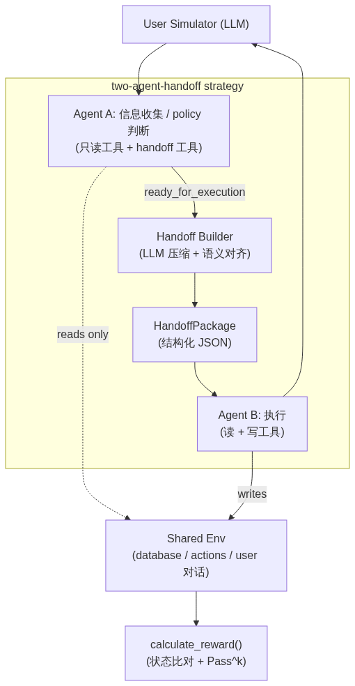
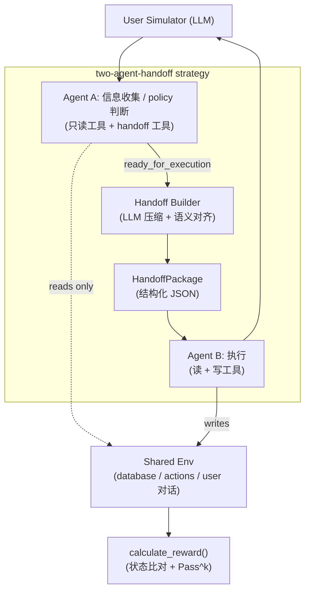

# tau-multi-agent: 上下游 Agent 上下文传输协议评测基准

本项目在 [τ-bench](https://github.com/sierra-research/tau-bench) 的基础上扩展，构建一个用于评测 **上下游 Agent 之间信息传输协议** 的基准。核心问题：

> Agent A 执行任务的前半段后，能否通过一个 **压缩 + 语义对齐** 的 handoff package，把任务状态准确传给 Agent B，让 Agent B 在不接触完整历史的情况下继续完成剩余任务？

原始 τ-bench 评测的是「单个 Agent 在多轮对话中调用工具、遵守业务规则完成用户请求」的能力。本项目在保留其任务、用户模拟器、业务策略、工具和自动判分的前提下，新增了一条 **双 Agent + 结构化 handoff** 的评测链路。

---

## 1. 总体架构



<details>
<summary>架构图 mermaid 源码（点击展开，修改后可重新渲染）</summary>



</details>

四个 LLM 角色完全独立可配（见第 5 节）：

| 角色 | 作用 | 工具权限 |
| --- | --- | --- |
| Agent A | 上游信息收集、policy 判断、获取用户确认 | 只读/policy 工具 + `ready_for_execution` 交接工具 |
| Agent B | 下游执行，完成写操作 | 读 + 写工具（全部工具） |
| Handoff Builder | 把 Agent A 的完整上下文压缩为结构化 package | 无（纯 LLM 压缩） |
| User Simulator | 扮演用户，逐步透露信息 | 无 |

### 关键设计

- **触发机制（工具拆分）**：Agent A 的 schema 里只展示读/policy 工具，写工具完全不给。当 A 准备执行写操作时，调用 `ready_for_execution` 工具触发交接（兜底：若 A 幻觉出写工具名，wrapper 也按交接处理，绝不让 A 写库）。
- **共享 env**：Agent A、Agent B 操作同一个 `Env` 实例。A 只读不改数据库，`env.step()` 持续维护数据库、动作记录和用户对话。因此 handoff package **只需替代「Agent 侧的消息历史」**，无需改动 env —— `env.tools_map` 始终能执行任何工具，工具拆分只控制「展示给各子 Agent 的 schema」。
- **判分不变**：B 完成后照常走原始 `Env.calculate_reward()`，通过重放 ground-truth 动作比对数据库 hash，复用全部 Pass^k 指标基建，不引入主观评审。

---

## 2. 目录结构

```text
tau-multi-agent/
├── run.py                         # CLI 入口（argparse + .env 默认值）
├── .env / .env.example            # 凭证与四角色模型配置
├── tau_bench/
│   ├── __init__.py                # 启动时自动加载 .env，并镜像 OpenAI base URL
│   ├── run.py                     # 批量跑任务、agent_factory、Pass^k 指标
│   ├── types.py                   # RunConfig / Task / SolveResult 等数据结构
│   ├── agents/
│   │   ├── base.py                # Agent 抽象接口：solve(env, task_index)
│   │   ├── tool_calling_agent.py  # 单 Agent 基线（function calling）
│   │   ├── chat_react_agent.py    # ReAct / Act 基线
│   │   ├── few_shot_agent.py      # few-shot 基线
│   │   └── two_agent_handoff_agent.py   # ★ 双 Agent handoff 核心 wrapper
│   ├── handoff/                   # ★ 新增的 handoff 模块
│   │   ├── types.py               # HandoffPackage 结构化 schema
│   │   ├── tool_split.py          # 读/写工具分类、split_tools_info、handoff 工具
│   │   └── builder.py             # LLM 压缩生成 package + 压缩比指标
│   └── envs/
│       ├── base.py                # Env：reset/step/calculate_reward
│       ├── user.py                # 用户模拟器（llm / react / verify / reflection）
│       ├── retail/                # 零售域：env + tools + tasks + data + wiki
│       └── airline/               # 航空域：env + tools + tasks + data + wiki
├── historical_trajectories/       # 历史运行轨迹
└── few_shot_data/                 # few-shot 示例
```

---

## 3. 双 Agent handoff 执行流程

`TwoAgentHandoffAgent.solve()`（[tau_bench/agents/two_agent_handoff_agent.py](tau_bench/agents/two_agent_handoff_agent.py)）的步骤：

1. `env.reset()` 取初始用户消息；用 `split_tools_info(domain)` 得到 A / B 工具集。
2. **Agent A 循环**（预算约 `max_num_steps // 2`）：system = wiki + A 角色说明。命中 `ready_for_execution`（或幻觉写工具名）→ 记录并跳出；否则正常 `env.step`（respond → 用户 / 读工具）。
3. `build_structured_package(...)` 用 builder 模型把 A 的历史压缩成 `HandoffPackage`。
4. **Agent B 循环**（剩余预算）：system = wiki + B 角色说明 + 渲染后的 package；首个 user 消息注入「接管提示 + 用户最后一句话」。B 持读+写工具，继续 `env.step` 直到完成或预算耗尽。
5. 返回 `SolveResult`：`messages` 合并 A/B 轨迹；`info` 注入 `handoff_package`、`compression_ratio`、`agent_a_steps`/`agent_b_steps`、各角色实际模型等，便于后续分析。

若任务在 Agent A 阶段就结束（如直接转人工），则不触发 handoff，直接返回。

---

## 4. Handoff Package 结构

由 [tau_bench/handoff/types.py](tau_bench/handoff/types.py) 定义（pydantic 校验），核心字段：

| 字段 | 含义 |
| --- | --- |
| `completed_subtasks` | Agent A 已完成的子任务 |
| `remaining_subtasks` | 留给 Agent B 的子任务 |
| `tool_trace_summary` | 工具调用结果摘要（tool / result / ref） |
| `intermediate_state` | 执行所需的中间状态（order_id、status、eligibility 等） |
| `semantic_frame` | 意图 + 槽位（intent / slots） |
| `kept_constraints` | 必须遵守的用户约束与业务规则 |
| `execution_boundary` | 允许/禁止的动作、确认状态 |
| `refs` / `recover_hint` | 引用 id 与恢复更多上下文的提示 |
| `token_full` / `token_count` / `compression_ratio` | 压缩分析指标 |

Builder（[tau_bench/handoff/builder.py](tau_bench/handoff/builder.py)）用一次 LLM 调用（`response_format=json_object`）生成 package，校验失败会重试一次，再失败则回退到最小骨架，保证单次压缩失败不会中断整轮评测。

---

## 5. 配置（全部在 `.env` 中完成）

启动时 `tau_bench/__init__.py` 会自动加载 `.env`，并把自定义 base URL 同时镜像到 `OPENAI_BASE_URL` 和 `OPENAI_API_BASE`（兼容不同版本的 litellm / OpenAI SDK）。

四个角色的模型可在 `.env` 独立配置，互不影响；任一 agent 角色未设时回退到 `TAU_MODEL`。复制模板开始：

```bash
cp .env.example .env
```

### 示例：使用 Qwen（OpenAI 兼容接口）

```dotenv
OPENAI_API_KEY=sk-your-qwen-key
OPENAI_BASE_URL=https://dashscope.aliyuncs.com/compatible-mode/v1

# 四个角色（provider 用 openai，因为走的是 OpenAI 兼容端点；模型名是 qwen）
TAU_AGENT_A_MODEL=qwen-plus
TAU_AGENT_A_MODEL_PROVIDER=openai
TAU_AGENT_B_MODEL=qwen-plus
TAU_AGENT_B_MODEL_PROVIDER=openai
TAU_HANDOFF_BUILDER_MODEL=qwen-plus
TAU_HANDOFF_BUILDER_MODEL_PROVIDER=openai
TAU_USER_MODEL=qwen-plus
TAU_USER_MODEL_PROVIDER=openai
```

### 环境变量总览

| 变量 | 作用 | CLI 对应 |
| --- | --- | --- |
| `OPENAI_API_KEY` | API key | — |
| `OPENAI_BASE_URL` | OpenAI 兼容端点 URL | — |
| `TAU_MODEL` / `TAU_MODEL_PROVIDER` | 三个 agent 角色的基础回退模型 | `--model` / `--model-provider` |
| `TAU_AGENT_A_MODEL(_PROVIDER)` | Agent A 模型 | `--agent-a-model(-provider)` |
| `TAU_AGENT_B_MODEL(_PROVIDER)` | Agent B 模型 | `--agent-b-model(-provider)` |
| `TAU_HANDOFF_BUILDER_MODEL(_PROVIDER)` | 压缩器模型 | `--handoff-builder-model(-provider)` |
| `TAU_USER_MODEL(_PROVIDER)` | 用户模拟器模型 | `--user-model(-provider)` |
| `TAU_ENV` | 默认域（retail / airline） | `--env` |

CLI 参数优先级高于 `.env`。

---

## 6. 安装与运行

```bash
# 安装（同时安装 litellm 等依赖）
pip install -e .

# 配置好 .env 后，运行双 Agent handoff（模型全部从 .env 读取）
python run.py --agent-strategy two-agent-handoff --env retail --task-ids 0

# 作为对照，跑单 Agent 基线（上界参考）
python run.py --agent-strategy tool-calling --env retail --task-ids 0
```

让 A / B / 压缩器使用不同模型的示例（覆盖 `.env`）：

```bash
python run.py --agent-strategy two-agent-handoff --env retail \
  --agent-a-model qwen-max   --agent-a-model-provider openai \
  --agent-b-model qwen-plus  --agent-b-model-provider openai \
  --handoff-builder-model qwen-turbo --handoff-builder-model-provider openai \
  --task-ids 0 2 4
```

常用参数：`--task-split {train,test,dev}`、`--num-trials N`（算 Pass^k）、`--max-concurrency N`、`--task-ids ...`、`--start-index/--end-index`。

---

## 7. 评测指标

结果 JSON 写入 `results/`，控制台输出复用原始 τ-bench 指标：

- **Average reward**：单次任务成功率（reward 为 0/1，最终数据库状态全对才为 1）。
- **Pass^k**：同一任务多次运行的稳定成功率（需 `--num-trials > 1`）。

双 Agent 链路额外在每条结果的 `info` 中记录分析项：`handoff_package`、`compression_ratio`、`token_full`/`token_count`、`agent_a_steps`/`agent_b_steps`，以及 `agent_a_model`/`agent_b_model`/`handoff_builder_model`。

---

## 8. 现状与路线图

已完成（第一阶段地基）：

- 结构化 HandoffPackage schema 与工具拆分
- LLM 压缩 builder（含压缩比指标）
- `TwoAgentHandoffAgent` 双 Agent wrapper，接入 `run.py`（`--agent-strategy two-agent-handoff`）
- 四角色模型 + 凭证全部可在 `.env` 配置
- retail / airline 工具读写拆分

后续迭代：

- Full / Summary Handoff 三方法对比（当前 baseline 为 Single Agent + Proposed Structured）
- 批量分析指标脚本（slot accuracy、constraint recall、duplicate action rate、boundary violation rate 等）
- 更细的 handoff 点配置与 gold_handoff 标注

---

## 致谢

本项目基于 Sierra Research 的 τ-bench 构建。原始基准请见 [τ-bench](https://github.com/sierra-research/tau-bench) 与 [τ²-bench / τ³-bench](https://github.com/sierra-research/tau2-bench)。

```bibtex
@misc{yao2024tau,
      title={$\tau$-bench: A Benchmark for Tool-Agent-User Interaction in Real-World Domains},
      author={Shunyu Yao and Noah Shinn and Pedram Razavi and Karthik Narasimhan},
      year={2024},
      eprint={2406.12045},
      archivePrefix={arXiv},
      primaryClass={cs.AI},
      url={https://arxiv.org/abs/2406.12045},
}
```
